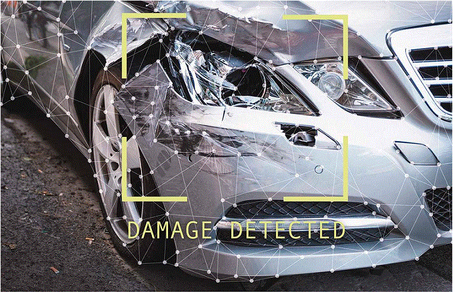

# [Car Damage Detective](https://site.com/)
 
[](https://github.com/facebook/react/blob/master/LICENSE)
[](https://www.python.org/)
[](https://GitHub.com/Naereen/StrapDown.js/graphs/commit-activity)
[](https://reactjs.org/docs/how-to-contribute.html#your-first-pull-request)

## Get a genuine report of your damaged Car

All you need to do is upload pictures of your car and our system will process them to find all the damage locations.


## Contributing

The main purpose of this repository is to continue to evolve project, making it faster and easier to use. Development happens in the open on GitHub, and we are grateful to the community for contributing bugfixes and improvements. Read below to learn how you can take part in improving.

## Installation

```bash
cd car-damage-detective-web
```
#### on bash

```bash
python -m venv venv

. venv/bin/activate
```

#### on windows

```bash
py -3 -m venv venv

venv\Scripts\activate
```

```bash
pip install Flask

pip install sql_alchemy

python app.py
```
### License

Car Damage Detective is [MIT licensed](./LICENSE).
